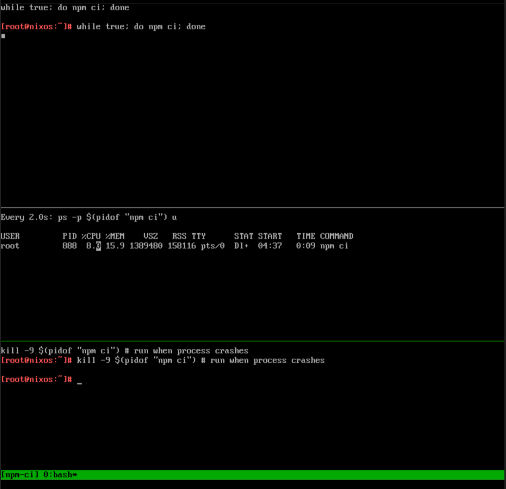
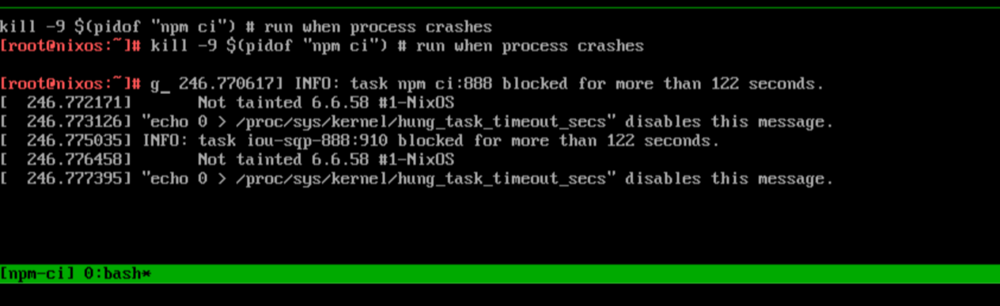
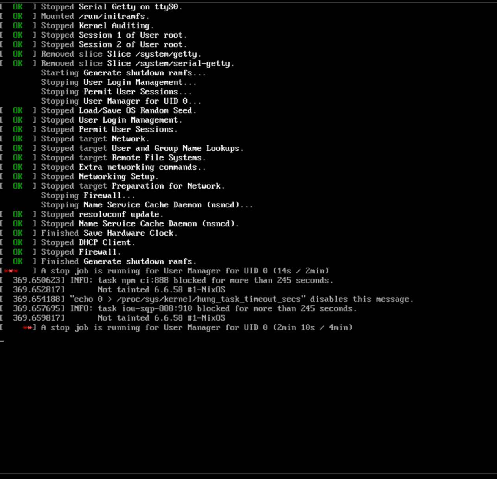
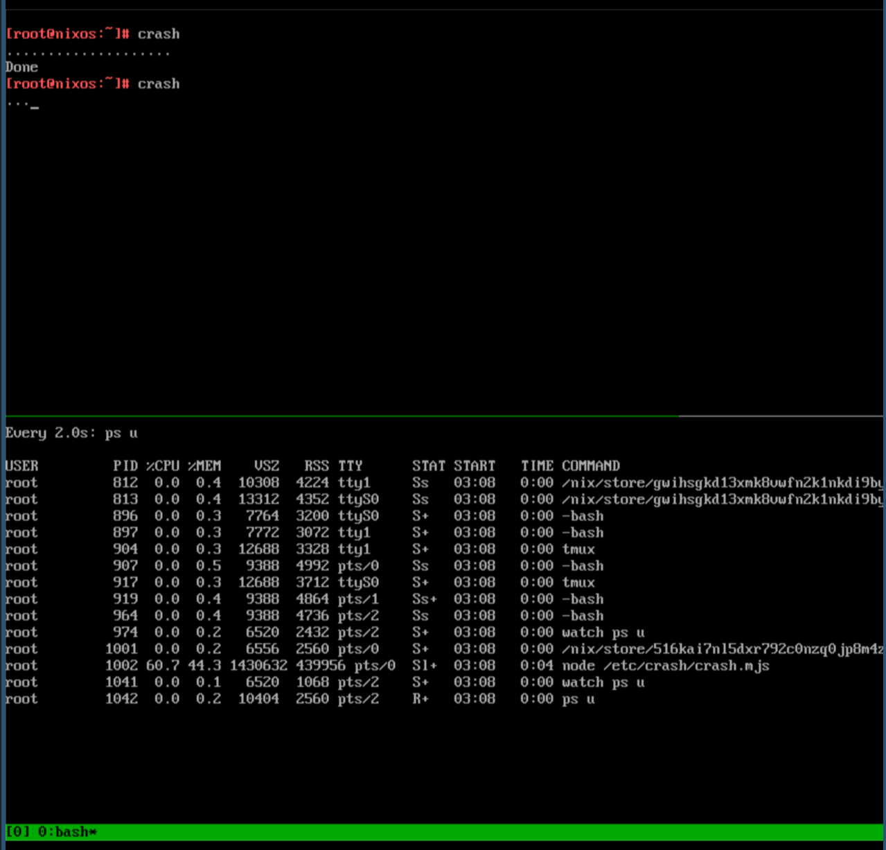
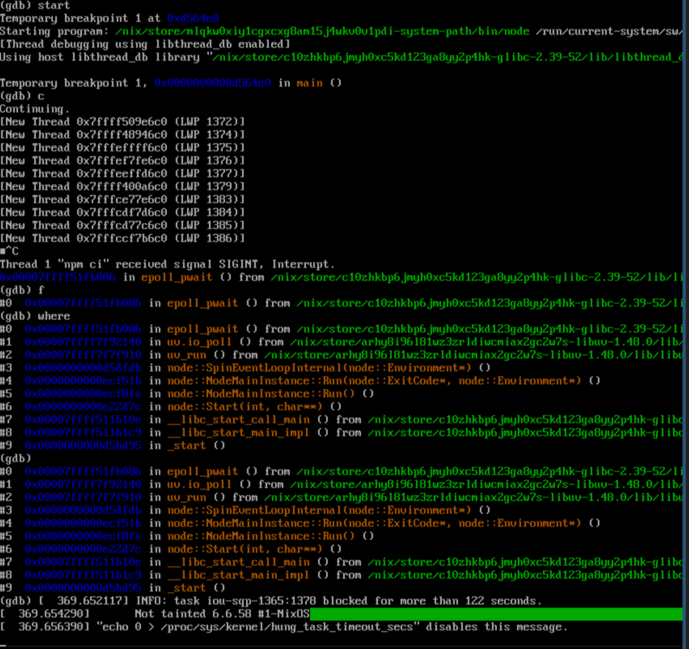
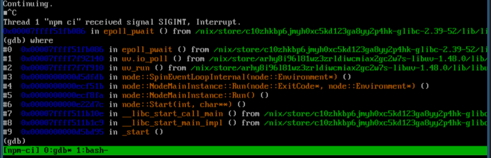

# libuv + Linux 6.6 LTS uninterruptible process crash reproduction

Keywords:

- io_uring
- libuv
- Linux LTS 6.6
- NixOS

References:

- https://github.com/nodejs/node/issues/55587
- https://github.com/libuv/libuv/issues/4598
- https://lore.kernel.org/io-uring/3d913aef-8c44-4f50-9bdf-7d9051b08941@app.fastmail.com/T/#mcddcf299eb2ec40aca4bf8b938067b9682c8eb27

# Screenshots

First some screenshots to make clear what I see on my system when a crash occurs:








# Requirements

- [Nix](https://nixos.org/download/#download-nix)
- [Nix flake support](https://nixos.wiki/wiki/Flakes)
- x86_64 host that can run QEMU/KVM images

# How to reproduce

## Using the QEMU serial console

QEMU will launch in serial console mode. Using a serial console makes it easier
to copy text between different programs. You can disable the serial console by
removing the following line in `configuration.nix`:

```patch
 virtualisation.cores = 2;
-virtualisation.graphics = false;
 # No need to allocate disk space
 virtualisation.diskImage = null;
```

__Important__: You can exit the serial console by pressing `Ctrl-a + c` and
then typing `quit` and pressing the `Enter/Return` key. If your terminal is
messed up after the QEMU serial console session, run `reset`. You can

## Ways problem can be reproduced

Either

- npm ci, or
- node /etc/crash/cash.mjs

will do. For the second, you can run the command `crash` in the terminal.

Crash will crash with semi-high likelihood:



## Reproduction steps

1. Start QEMU VM using the following command:

```bash
nix run .#nixosConfigurations.nixos-vm.config.system.build.vm
```

2. You are automatically logged in as rot
3. Run the command `reproducer`, and a reproduction tmux contraption is executed
   with the top pane running `npm ci` in an infite loop:

```bash
while true; do npm ci; done
```

4. The middle pane shows the current state of `npm ci` using `watch ps`.
5. Wait for CPU activity in `npm ci` to die down and execute the following in
   the bottom pane:

```bash
# You are automatically focus on the bottom pane
# Refer to ps u PID for NODE_PROCESS_PID
kill -9 $NODE_PROCESS_PID
```

6. If `npm ci` quits successfully, it is rerun, so please wait.
7. If `npm ci` crashes, you will see the tmux pane with `watch ps u` say:

```
# Some of the values may vary
USER PID  %CPU $MEM VS2     RSS   TTY   STAT START TIME COMMAND
root $PID 4.0  0.4  1313736 71744 pts/0 Dl+  01:46 0:01 npm ci
```

8. Roughly a minute later you will see Kernel warnings being output in the
   console and on `dmesg`. Note: If you don't kill the process, an error message
   might not be shown. Please make sure you try to kill `npm ci`:

```
INFO: task iou-sqp-1031:1039 blocked for more than 122 seconds.
   Not tained 6.6.58 #1-NixOS
```

9. Try turning the machine off with `poweroff`. The systemd shutdown target
   will fail at terminating the root user's processes.

# Debugging and tracing

## Gdb

It's possible to reproduce the bug inside gdb when running:

```bash
gdb --args node $(which npm) ci
```





Here's the stack trace:

```
0x00007ffff51fb086 in epoll_pwait ()
   from /nix/store/c10zhkbp6jmyh0xc5kd123ga8yy2p4hk-glibc-2.39-52/lib/libc.so.6
(gdb) where
#0  0x00007ffff51fb086 in epoll_pwait ()
   from /nix/store/c10zhkbp6jmyh0xc5kd123ga8yy2p4hk-glibc-2.39-52/lib/libc.so.6
#1  0x00007ffff7f92140 in uv.io_poll ()
   from /nix/store/arhy8i96l81wz3zrldiwcmiax2gc2w7s-libuv-1.48.0/lib/libuv.so.1
#2  0x00007ffff7f7f910 in uv_run ()
   from /nix/store/arhy8i96l81wz3zrldiwcmiax2gc2w7s-libuv-1.48.0/lib/libuv.so.1
#3  0x0000000000d5dfdb in node::SpinEventLoopInternal(node::Environment*) ()
#4  0x0000000000ecf51b in node::NodeMainInstance::Run(node::ExitCode*, node::Environment*) ()
#5  0x0000000000ecf8fa in node::NodeMainInstance::Run() ()
#6  0x0000000000e22d7c in node::Start(int, char**) ()
#7  0x00007ffff511b10e in __libc_start_call_main ()
   from /nix/store/c10zhkbp6jmyh0xc5kd123ga8yy2p4hk-glibc-2.39-52/lib/libc.so.6
#8  0x00007ffff511b1c9 in __libc_start_main_impl ()
   from /nix/store/c10zhkbp6jmyh0xc5kd123ga8yy2p4hk-glibc-2.39-52/lib/libc.so.6
#9  0x0000000000d5bd95 in _start ()
```

## Ltrace

Trace libuv calls:

```bash
# Trace just calls to libuv.so.1
ltrace -t -f --library libuv.so.1 --output ltrace.log node $(which npm) ci
# Trace system calls as well
ltrace -t -f -S --library libuv.so.1 --output ltrace_sys.log node $(which npm) ci
# Trace calls within libuv.so.1 to uv__iou functions with backtrace
ltrace -t -f -L -w3 -x 'uv__iou*@libuv.so.1' --output ltrace_uv.log node $(which npm) ci
```

This repo contains the following files:

- `ltrace.log` has the results of the first command with the process getting stuck
- `ltrace_sys.log.tar.gz` has the results of the second command above with the process getting stuck and terminated using `kill -9 $(pidof "npm ci")`.  File is tar/gzipped
- `ltrace_uv.log` has a trace of calls to `uv__iou*` functions within libuv

Looking at the last trace above, `ltrace_uv.log`, we can see that most of
the libuv library calls go to `uv_fs_lstat`:

```
$grep ltrace_uv.log -E -e 'libuv.so.1\(uv_.+\)' | sort | uniq -c | sort -hr
   2790  > libuv.so.1(uv_fs_lstat+0x81) [7f191cd792d1]
   1414  > libuv.so.1(uv__iou_fs_statx+0x45) [7f191cd86cb5]
   1406  > libuv.so.1(uv__iou_fs_statx+0x98) [7f191cd86d08]
   1398  > libuv.so.1(uv_fs_lstat+0x83) [7f191cd792d3]
     28  > libuv.so.1(uv_fs_open+0x96) [7f191cd797c6]
     18  > libuv.so.1(uv_fs_read+0xd0) [7f191cd79940]
     18  > libuv.so.1(uv_fs_fstat+0x67) [7f191cd78ed7]
     18  > libuv.so.1(uv_fs_close+0x60) [7f191cd78ae0]
     14  > libuv.so.1(uv__iou_fs_open+0x57) [7f191cd86a27]
     14  > libuv.so.1(uv__iou_fs_open+0x1e) [7f191cd869ee]
     14  > libuv.so.1(uv_fs_open+0x98) [7f191cd797c8]
     12  > libuv.so.1(uv_fs_stat+0x7e) [7f191cd7a27e]
      9  > libuv.so.1(uv__iou_fs_read_or_write+0xba) [7f191cd86c1a]
      9  > libuv.so.1(uv__iou_fs_read_or_write+0x8b) [7f191cd86beb]
      9  > libuv.so.1(uv__iou_fs_close+0x5a) [7f191cd8687a]
      9  > libuv.so.1(uv__iou_fs_close+0x41) [7f191cd86861]
      9  > libuv.so.1(uv_fs_read+0xd2) [7f191cd79942]
      9  > libuv.so.1(uv_fs_fstat+0x69) [7f191cd78ed9]
      9  > libuv.so.1(uv_fs_close+0x62) [7f191cd78ae2]
      6  > libuv.so.1(uv_loop_init+0x22b) [7f191cd7ba3b]
      6  > libuv.so.1(uv__io_poll+0x54f) [7f191cd8748f]
      6  > libuv.so.1(uv_fs_stat+0x80) [7f191cd7a280]
      4  > libuv.so.1(uv_fs_mkdir+0x82) [7f191cd79522]
      3  > libuv.so.1(uv__platform_loop_init+0x77) [7f191cd865c7]
      3  > libuv.so.1(uv__platform_loop_init+0x61) [7f191cd865b1]
      2  > libuv.so.1(uv_run+0xaf) [7f191cd7490f]
      2  > libuv.so.1(uv__iou_fs_mkdir+0x52) [7f191cd869b2]
      2  > libuv.so.1(uv__iou_fs_mkdir+0x2a) [7f191cd8698a]
      2  > libuv.so.1(uv_fs_mkdir+0x84) [7f191cd79524]
      2  > libuv.so.1(uv_default_loop+0x2e) [7f191cd7341e]
```

Other runs will have fewer or more calls to `libuv.so.1`, depending on
how soon the program crashes.

Another observation: `npm ci` crashes at different points in its process.
This can be seen by running

```bash
find node_modules | wc
```

And seeing a different number of files between each run. This implies that the
`npm ci` crashes at different times in a non-deterministic way.

## Tracing system calls

This will trace all calls made to kernel function `io_uring_setup` and
include a backtrace:

```bash
strace -e io_uring_setup -f -k --output strace_io_uring_setup.log node $(which npm) ci
```

The contents are in `strace_io_uring_setup.log`.

sq and cq sizes:

```
# sed -E -n -e 's/^.+(sq_entries=[0-9]+, cq_entries=[0-9]+).+$/\1/p' strace_io_uring_setup.log
sq_entries=64, cq_entries=128
sq_entries=256, cq_entries=512
sq_entries=64, cq_entries=128
sq_entries=256, cq_entries=512
sq_entries=64, cq_entries=128
sq_entries=256, cq_entries=512
```

## Copy files

You can copy files between host and guest using `nc`. It's a bit hacky but
it works:

```bash
# On host, choose a port and open your FW if needed
nc -vlp 4444 > file_name.txt
# On guest, determine host IP and use nc to write file
nc -Nv $IP 4444 < file_name.txt
```
